# Reverse IP Web Application

This is a simple Flask application that captures and stores reversed IP addresses. The application has two main routes: the root (`/`) that displays the client's IP address and the reversed IP, and `/all` that shows all reversed IPs stored so far.

currently live on: http://ac38de43890fe4864b6c0affade96595-5c685da0e71fc0f4.elb.us-east-2.amazonaws.com/

## Getting Started

These instructions will get you a copy of the project up and running on your local machine for development and testing purposes.

### Prerequisites

- Python 3.8+
- Docker
- Kubernetes cluster
- Helm v3 or newer
- kubectl command-line tool
- Jenkins CI/CD tool


### Running Locally

1. Clone the repository:

    ```bash
    git clone https://github.com/jezenith/je-deel-test.git
    cd je-deel-test
    ```

2. Install the required Python packages:

    ```bash
    pip install -r requirements.txt
    ```

3. Run the application:

    ```bash
    python app.py
    ```

The application will be available at `http://localhost:5001`.

### Running with Docker

1. Build the Docker image:

    ```bash
    docker build -t je-deel-test .
    ```

2. Run the Docker container:

    ```bash
    docker run -p 5001:5001 je-deel-test
    ```

The application will be available at `http://localhost:5001`.

### Deploying with Kubernetes

Navigate to the Kubernetes folder:

1. Apply the Kubernetes manifest:

    ```bash
    kubectl apply -f k8s-manifest.yaml
    ```

2. The application will be deployed on a network load balancer:

    ```bash
    kubectl get svc je-deel-test-service
    ```

The application will be available at the external IP or load balancer endpoint of the service.

### Deploying with Jenkins using Helm

1. Prepare your Jenkins server and add the SCM to poll from Jenkinsfile in the master branch:

    ```bash
    Click 'Build Now' or do a merge to the master branch. The pipeline will trigger and build, deploy the web app automatically.
    ```

2. Get the external IP of the service:

    ```bash
    kubectl get svc je-deel-test-service
    ```

The application will be available at the external IP or ELB endpoint of the service.

## CI/CD Pipeline

The CI/CD pipeline is configured using Jenkins. The pipeline runs on every push to the `master` branch. Here's what happens in each job:

1. **Install Dependencies**: Installs the required Python packages and Pylint for code quality checking.
2. **Unit Test**: Runs the unit tests using Python's unittest module.
3. **Pylint**: Performs static code analysis using Pylint.
4. **Build Image**: Builds the Docker image.
5. **Deploy Docker Image**: Pushes the Docker image to the Docker registry.
6. **Remove Unused Docker Image**: Removes the unused Docker image from the Jenkins agent.
7. **Deploy to Kubernetes**: Deploys the application to the Kubernetes cluster using the Helm chart.

All these steps are defined in the `Jenkinsfile` in the root directory of this repository.

## Helm Chart

The Helm chart, located in the je-deel-test-chart directory, is structured as follows:

Chart.yaml: This is the main file that includes the description of your Helm chart. It includes the version of the chart and the app version.

values.yaml: This file defines the default configuration values for this chart. It includes the replica count, image details, service details, resource requests and limits, and the details for the readiness and liveness probes.

templates/deployment.yaml: This file defines the Kubernetes Deployment for your application. It uses the values from values.yaml to set the number of replicas, the Docker image to use, the container port, and the readiness and liveness probes.

templates/service.yaml: This file defines the Kubernetes Service for your application. It uses the values from values.yaml to set the service type, port, and target port.

templates/hpa.yaml: This file defines the Horizontal Pod Autoscaler (HPA) for your application. It uses the values from values.yaml to set the minimum and maximum number of replicas and the CPU utilization threshold for scaling.

The Helm chart allows to package the web application and deploy it on a Kubernetes cluster with a single command, helm install. The values in values.yaml can be overridden at install time, allowing for flexibility and customization.

## Troubleshooting

If you encounter any issues, please check the logs of the pods. You can do this by running:

```bash
kubectl logs <pod-name>
